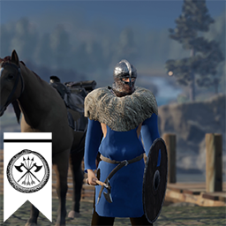
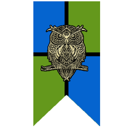
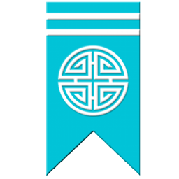
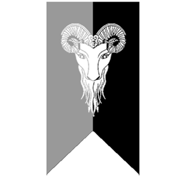

# The Nations of Almerra

This is the content for section 1. You can write **bold** text, *italic* text, and even create lists:

### Alyssakin Freetribe

- Item 1
- Item 2
- Item 3

### Rowani Empire

- Item 1
- Item 2
- Item 3

### Republic of Graata

- Item 1
- Item 2
- Item 3

### Neagese Dynasty

- Item 1
- Item 2
- Item 3

### Monayan Kingdom

- Item 1
- Item 2
- Item 3

### Other Uncontacted Tribes
- Item 1
- Item 2
- Item 3